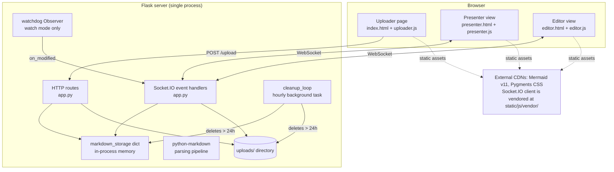
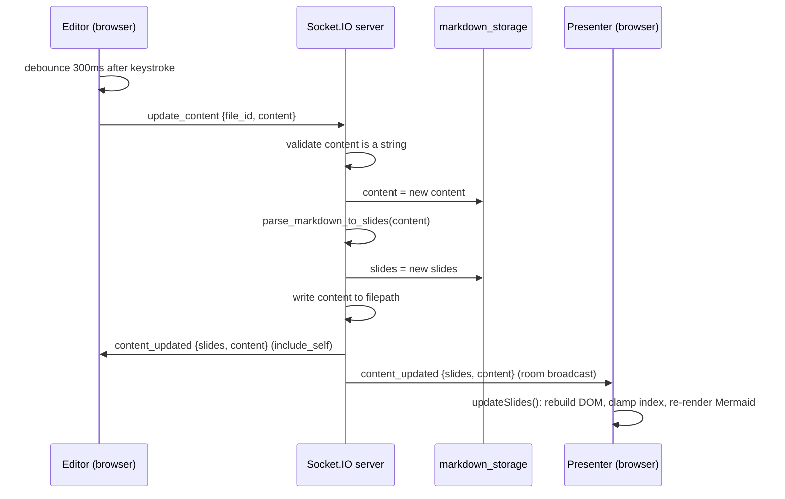

# Architecture

MD Presenter turns Markdown files into live, synchronized presentations. This document
describes how the system actually works; every claim is traceable to the code.

## System Context



## Components

| Component | File | Responsibility |
|-----------|------|----------------|
| Flask app + routes | `app.py` | Upload, present, edit, JSON APIs |
| Socket.IO handlers | `app.py` | Live sync between editor and presenters |
| Parsing pipeline | `parse_markdown_to_slides()` in `app.py` | Markdown → per-slide HTML |
| Media syntax | `process_media_links()` in `app.py` | `![video]`, `![youtube]`, `![vimeo]`, `![svg]`, sized images |
| File watcher | `MarkdownFileWatcher` in `app.py` | Debounced re-parse on file changes (watch mode) |
| Cleanup | `cleanup_old_files()` / `cleanup_loop()` in `app.py` | Hourly deletion of 24h-old uploads |
| Upload UI | `static/js/uploader.js` | Drag-drop upload, progress, recent documents (localStorage) |
| Presenter logic | `static/js/presenter.js` | Navigation, keyboard, theme, slide rebuild on sync |
| Mermaid zoom | `static/js/mermaid-controls.js` | Wheel/pinch/keyboard zoom via viewBox manipulation |
| Editor | `static/js/editor.js` | Debounced `update_content`, local preview, toolbar |

## Request and Data Flow

### Upload mode

1. `POST /upload` validates the file part, extension (`.md`/`.markdown`), and 10MB size cap.
2. File saved to `uploads/<uuid4>.md`; content read back and parsed into slides.
3. Entry stored in `markdown_storage[file_id]` (`filename`, `content`, `slides`,
   `created_at`, `filepath`); `file_id` also placed in the Flask session.
4. Client is redirected to `/present/<file_id>`.

### Watch mode (`python app.py -m file.md`)

1. `load_markdown_file()` computes a **stable** id: first 12 hex chars of
   `md5(absolute_path)` — the URL survives restarts.
2. Entry is stored with `"watched": True`, which exempts it from cleanup.
3. A watchdog `Observer` watches the file's directory; `on_modified` debounces
   (300ms) rapid writes, re-reads the file, re-parses, and broadcasts
   `content_updated` to the file's room.

### Live editing



## Slide Parsing Pipeline (`parse_markdown_to_slides`)

For each slide segment (split on the regex `\n---+\n` after CRLF normalization):

1. **Speaker notes** — `<!-- notes -->...<!-- /notes -->` extracted to `slide["notes"]`
   and removed from the slide body.
2. **Mermaid detection** — ` ```mermaid ` fenced blocks captured to `slide["mermaid"]`
   (first match); the raw text is later re-rendered client-side by Mermaid.js.
3. **Media syntax** — `process_media_links()` rewrites `![video]`, `![svg]`, sized
   images, YouTube/Vimeo links into HTML.
4. **HTML block preservation** — `<blockquote>` elements with classes
   `instagram-media` / `twitter-tweet` / `tiktok-embed` (plus an adjacent `<script>`)
   are replaced with `{{HTML_BLOCK_N}}` placeholders so python-markdown cannot escape them.
5. **Script extraction** — remaining `<script>` tags replaced with
   `{{SCRIPT_PLACEHOLDER_N}}` placeholders; restored after conversion and also kept in
   `slide["scripts"]` for injection by the presenter.
6. **Conversion** — python-markdown with extensions `extra`, `codehilite`,
   `fenced_code`, `toc`, `nl2br`, `attr_list`, `md_in_html`; `md.reset()` between slides.
7. **Title extraction** — first `#`-heading, else first non-empty non-code non-HTML
   line with formatting stripped, else `"Untitled"`.

Each slide dict: `{html, mermaid, notes, raw, scripts, title}`.

## WebSocket Events

All on the default namespace. `file_id` identifies the room.

| Event | Direction | Payload | Behavior |
|-------|-----------|---------|----------|
| `join_presentation` | client → server | `{file_id}` | `join_room(file_id)`; replies `joined {file_id}` |
| `leave_presentation` | client → server | `{file_id}` | `leave_room(file_id)` |
| `update_content` | editor → server | `{file_id, content}` | Validates content is a string; re-parses, persists file, broadcasts `content_updated` to room (sender included) |
| `content_updated` | server → clients | `{slides, content}` | Presenter rebuilds slide DOM; editor refreshes preview |
| `change_page` | client → server | `{file_id, page}` | Validates `page` is a non-negative int; stores it as the deck's `current_page` in `markdown_storage`; emits `page_changed` to room **excluding** sender |
| `page_changed` | server → clients | `{page}` | Other viewers navigate to the same slide |
| `request_sync` | client → server | `{file_id}` | Replies `sync_data {content, slides, current_page}` to requester only |

## Storage Model

- `markdown_storage: dict[file_id, entry]` — process-local memory. Not shared across
  workers; the app must run as a single process.
- Upload mode: `file_id = uuid4()`, `filepath` inside `uploads/`.
- Watch mode: `file_id = md5(abs_path)[:12]`, `filepath` is the source file,
  `watched: True`.
- Each entry also tracks `current_page` (server-side slide position), set by
  `change_page` and returned by `request_sync`; the remote-control page uses it to
  sync on join.
- `cleanup_loop()` (started in `__main__` via `socketio.start_background_task`) runs
  hourly: entries with `created_at` older than 24h have their file deleted and entry
  removed; entries with `watched` truthy are skipped.
- The `uploads/` directory is created at import time, so the app works under any WSGI
  invocation, not only `python app.py`.
- `SECRET_KEY` comes from `MD_PRESENTER_SECRET_KEY` (falls back to a random per-process
  value); Socket.IO CORS origins from `MD_PRESENTER_CORS_ORIGINS` (comma-separated,
  default `*`).

## Auxiliary Routes

| Route | Purpose |
|-------|---------|
| `/control/<file_id>` | Remote-control page (phone-friendly); emits `change_page`, joins the same room |
| `/qr/<file_id>` | SVG QR code encoding the control URL for that deck |
| `/download/<file_id>` | Raw markdown download (`Content-Disposition: attachment`) |
| `/present/<file_id>?print` | Print/PDF view — all slides stacked via `.print-mode` CSS; use browser Save-as-PDF |

## Frontend Rendering Model

- `presenter.html` receives pre-rendered slide HTML server-side (`{{ slide.html|safe }}`)
  plus Mermaid source and scripts; `presenter.js` rebuilds this DOM on `content_updated`
  (`updateSlides()`), clamping the current index when slides are removed.
- Mermaid v11 (ESM from jsDelivr) renders `.mermaid` divs; original diagram text is
  kept in `data-mermaid-original` so theme switches re-render correctly.
- `MermaidZoomController` attaches wheel/pinch/keyboard zoom per `.mermaid-container`;
  controllers are tracked in a module-level `WeakMap`, so re-initialization after slide
  updates never stacks duplicate observers or listeners.
- Theme is persisted in `localStorage` and applied via `<body data-theme>`; fullscreen
  state syncs through `fullscreenchange` events rather than optimistic toggles.
- The editor keeps a lightweight client-side mini-parser (`parseMarkdownToSlides` in
  `editor.js`) for its local preview; the server remains the source of truth for what
  presenters render (see known limitations in `maintenance.md`).
