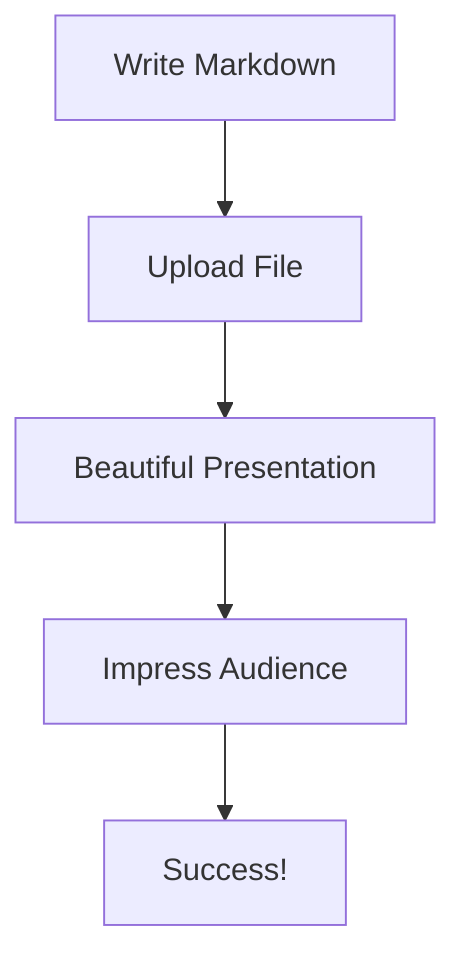
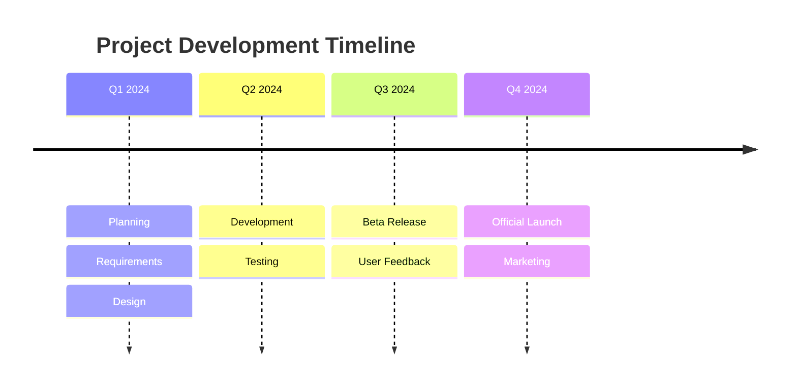
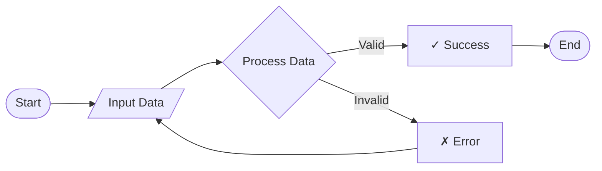

# Welcome to MD Presenter

## Transform Your Markdown into Beautiful Presentations

Create stunning presentations with the power of Markdown

---

## Features

- **Live Editing** - See changes in real-time
- **Mermaid Diagrams** - Beautiful flowcharts and diagrams
- **Rich Media** - Embed images, videos, and GIFs
- **Keyboard Shortcuts** - Navigate like a pro
- **Dark Mode** - Easy on the eyes

---

## Markdown Support

All your favorite markdown features:

- **Bold** and *italic* text
- `Inline code` and code blocks
- Lists and numbered lists
- > Blockquotes
- [Links](https://example.com)
- Tables

| Feature | Status |
|---------|--------|
| Markdown | ✅ |
| Live Edit | ✅ |
| Diagrams | ✅ |

---

## Code Highlighting

```python
def present_markdown(file_path):
    """Transform markdown into presentations"""
    with open(file_path, 'r') as f:
        content = f.read()

    slides = content.split('---')
    return render_slides(slides)
```

```javascript
// Navigate between slides
function nextSlide() {
    currentSlide++;
    showSlide(currentSlide);
}
```

---

## Mermaid Diagrams

Create beautiful diagrams with Mermaid:



---

## Media Support

### Images


### Videos


### Custom Sizing

{width=50%}

---

## Keyboard Shortcuts

Navigate your presentation efficiently:

- **→ / Space** - Next slide
- **←** - Previous slide
- **F** - Fullscreen mode
- **E** - Edit mode
- **G** - Go to slide
- **T** - Toggle thumbnails
- **ESC** - Exit fullscreen

---

## Live Editing

While presenting, you can:

1. Click **Edit** to modify your presentation
2. See changes update in real-time
3. Your audience sees updates instantly
4. No need to reload or restart

---

## Speaker Notes

Add speaker notes to your slides for reference during presentation.

<!-- notes -->
These are speaker notes that won't be visible to the audience.
You can add reminders, talking points, or additional context here.
<!-- /notes -->

---

## Advanced Layouts

### Lists with Icons

- 🚀 Fast and lightweight
- 🎨 Beautiful default styles
- 📱 Responsive design
- 🔧 Highly customizable
- 🌙 Dark mode support

---

## Mathematical Expressions

Support for mathematical notation:

The quadratic formula: `ax² + bx + c = 0`

Solutions: `x = (-b ± √(b² - 4ac)) / 2a`

---

## Quotes and Inspiration

> "The best way to predict the future is to invent it."
>
> — Alan Kay

> "Simplicity is the ultimate sophistication."
>
> — Leonardo da Vinci

---

## Tables and Data

| Language | Popularity | Trend |
|----------|------------|-------|
| Python | ⭐⭐⭐⭐⭐ | ↗️ |
| JavaScript | ⭐⭐⭐⭐⭐ | → |
| TypeScript | ⭐⭐⭐⭐ | ↗️ |
| Go | ⭐⭐⭐ | ↗️ |
| Rust | ⭐⭐⭐ | ↗️ |

---

## Timeline Diagram



---

## Flowchart Example



---

## Thank You

### Start Creating Amazing Presentations

1. Write in Markdown
2. Upload your file
3. Present with style

**Get started now!**

---

## Questions?

Feel free to explore all features:

- Try different themes
- Experiment with layouts
- Add your own content
- Share with others

*Happy Presenting! 🎉*
